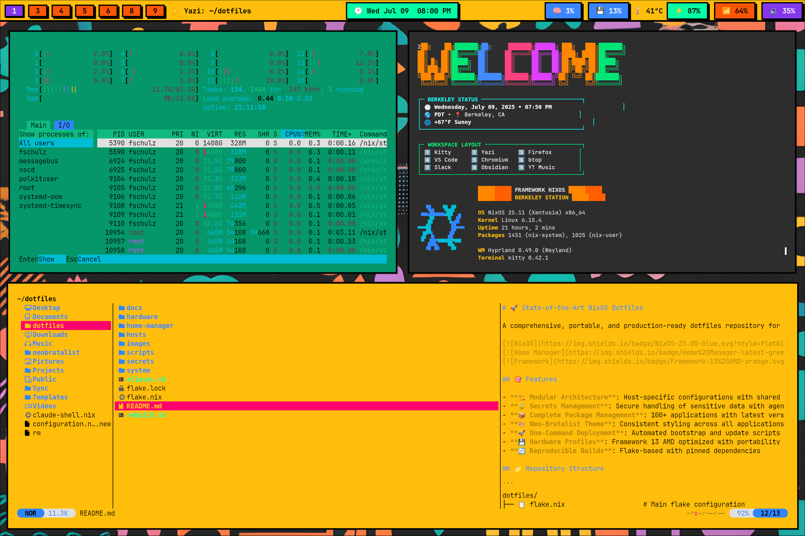
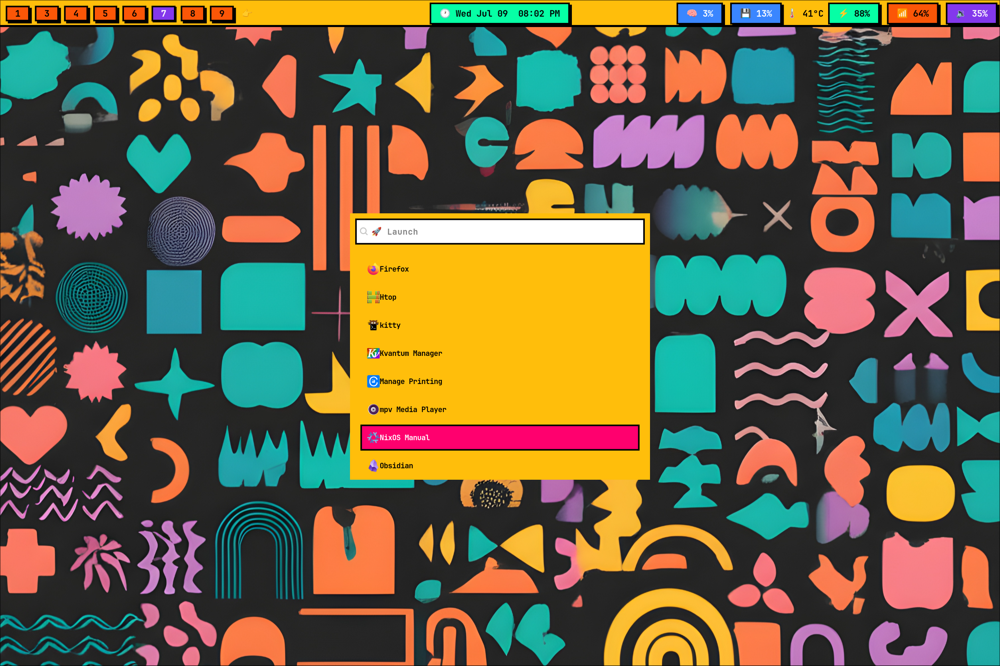

# 🚀 Neobrutalist NixOS

A comprehensive, portable, and production-ready dotfiles repository for NixOS with Home Manager, featuring a neo-brutalist aesthetic.

[](https://nixos.org)
[](https://github.com/nix-community/home-manager)
[](https://frame.work)

## 🎯 Features

- **🏗️ Modular Architecture**: Host-specific configurations with shared modules
- **🔒 Secrets Management**: Secure handling of sensitive data with agenix
- **📦 Complete Package Management**: 100+ applications with latest versions from unstable
- **🎨 Neo-Brutalist Theme**: Consistent styling across all applications
- **🚀 One-Command Deployment**: Automated bootstrap and update scripts
- **💾 Hardware Profiles**: Framework 13 AMD optimized with portability in mind
- **🔄 Reproducible Builds**: Flake-based with pinned dependencies
- **👥 Portable Configuration**: No hardcoded usernames - easily adoptable by others

## 📁 Repository Structure

```
dotfiles/
├── 📋 flake.nix                    # Main flake configuration
├── 🚀 rebuild.sh                   # Quick rebuild script (most used)
├── 🔗 aliases.sh                   # Convenient command aliases
├── 🏠 hosts/                       # Host-specific configurations
│   └── framework-nixos/
│       ├── configuration.nix       # NixOS system config
│       └── home.nix                # Home Manager config
├── 🔧 hardware/                    # Hardware profiles
│   └── framework-13-amd.nix        # Framework 13 AMD optimizations
├── 🏠 home-manager/                 # Home Manager modules (active)
│   ├── home.nix                    # User environment entry point
│   ├── build-home-manager.sh       # Build and switch script
│   ├── .env                        # Personal environment variables (gitignored)
│   ├── .env.template               # Template for environment variables
│   ├── config/                     # Configuration files
│   │   └── bashrc                  # Custom bashrc (version controlled)
│   └── modules/                    # Modular configurations
│       ├── packages.nix            # All user packages
│       ├── hyprland.nix            # Window manager
│       ├── kitty.nix               # Terminal with 4 color themes
│       ├── waybar.nix              # Status bar
│       ├── wofi.nix                # App launcher
│       ├── mako.nix                # Notifications
│       ├── gtk.nix                 # GTK theming
│       ├── qt.nix                  # Qt theming
│       └── ...                     # Additional modules
├── 💻 system/                      # System-level configurations
│   ├── hardware/                   # Hardware-specific configs
│   └── system/                     # Core system configuration
├── 🔐 secrets/                     # Secrets management
│   ├── README.md                   # Setup instructions
│   └── *.nix.template              # Configuration templates
├── 📜 scripts/                     # Deployment scripts
│   ├── bootstrap.sh                # Initial setup
│   └── deploy.sh                   # Update management
├── 📚 docs/                        # Documentation
│   └── HARDWARE.md                 # Hardware specifications
├── 🎨 wallpapers/                  # Desktop wallpaper collection
└── 🖼️ images/                      # Screenshots and previews
    ├── ws1.png                     # Workspace 1 demo
    └── ws7.png                     # Workspace 7 demo
```

## 🚀 Quick Start

### New Installation
```bash
# Clone the repository
git clone https://github.com/fmschulz/dotfiles.git ~/dotfiles
cd ~/dotfiles

# Configure your username and settings
./scripts/setup-user.sh

# Run bootstrap script
./scripts/bootstrap.sh
```

### Daily Usage (State-of-the-Art)
```bash
cd ~/dotfiles

# Quick rebuild (most common)
./rebuild.sh                    # Rebuild both system and home-manager
./rebuild.sh system             # Only rebuild system  
./rebuild.sh home               # Only rebuild home-manager

# Advanced deployment (with updates, checks, etc.)
./scripts/deploy.sh --all       # Full deployment with safety checks
./scripts/deploy.sh --home      # Home-manager only with checks

# Optional: Load convenient aliases
source aliases.sh               # Adds rebuild, deploy, nix-search, etc.
```

## 🖥️ System Overview

- **OS**: NixOS 25.05 (Warbler) 
- **WM**: Hyprland 0.49.0 (Wayland)
- **Bar**: Waybar with emoji indicators
- **Launcher**: Wofi with neo-brutalist theme
- **Terminal**: Kitty with 4 switchable color themes (Ctrl+Alt+1-4)
- **File Manager**: Yazi (terminal)
- **Notifications**: Mako with themed alerts
- **Lock Screen**: Hyprlock with blur effects
- **Prompt**: Starship with custom segments

### 🗂️ Workspace Layout
Applications automatically assign to designated workspaces:
- **1️⃣ Terminals** - Two kitty terminals (turquoise left, yellow right)
- **2️⃣ Yazi** - Terminal file manager  
- **3️⃣ Firefox** - Primary web browser
- **4️⃣ VS Code** - Development environment
- **5️⃣ Chromium** - Secondary browser
- **6️⃣ btop** - System monitoring
- **7️⃣ Slack** - Team communication
- **8️⃣ Obsidian** - Note-taking and knowledge management
- **9️⃣ YouTube Music** - Music streaming

## 🎨 Neo-Brutalist Theme

The entire desktop follows a consistent neo-brutalist aesthetic:
- **Colors**: Bold yellows (#FFBE0B), hot pink (#FF006E), turquoise (#06FFA5), blacks (#000000)  
- **Typography**: JetBrains Mono Nerd Font throughout
- **Borders**: Thick (3-4px) black borders everywhere with drop shadows
- **Shapes**: Sharp corners, no rounded elements
- **Contrast**: High contrast for maximum visibility

### Theme Preview

<div align="center">
  
  
  <br>
  <em>Left: Workspace 1 with dual terminals (turquoise/yellow) | Right: Workspace 7 with Slack</em>
</div>

## 📦 Included Software

### Development
- **Editors**: VS Code, Vim, Claude Code (latest)
- **Languages**: Python, Node.js, Rust toolchain
- **Tools**: Git, Lazygit, Delta, GitHub CLI
- **Scientific**: Quarto, Pixi, UV (from unstable)

### Communication
- Slack, Discord, Signal, Zoom
- Firefox, Chromium browsers

### Productivity
- Obsidian, YouTube Music
- Yazi terminal file manager

### System Tools
- Fastfetch, btop, htop monitoring
- Framework-specific utilities
- Docker, Tailscale, SSH tools

## 🏗️ Architecture

### Flake-Based Configuration
- **Inputs**: Pinned nixpkgs, home-manager, hardware profiles
- **Outputs**: NixOS configurations, Home Manager profiles, dev shells
- **Overlays**: Unstable packages for latest versions

### Host Management
- **Multi-Host Support**: Easy addition of new machines
- **Hardware Profiles**: Modular hardware-specific optimizations
- **Secrets**: Secure credential management with agenix

### Module System
- **Packages**: Centralized package management
- **Programs**: Individual application configurations
- **Services**: User-level service management
- **Theming**: Consistent styling across all applications

## 🔧 Customization

### User Configuration (Portable Setup)
The dotfiles are designed to be portable and easily adopted by other users:

1. **Initial Setup**: Run `./scripts/setup-user.sh` to configure:
   - Your username (replaces hardcoded usernames throughout configs)
   - Full name and email (for git)
   - SSH server aliases with terminal compatibility

2. **User Settings**: Edit `hosts/framework-nixos/user.nix` to modify:
   ```nix
   {
     username = "yourusername";
     fullName = "Your Name";
     email = "your.email@example.com";
     
     sshAliases = {
       myserver = "user@myserver.com";
     };
   }
   ```

3. **What's Portable**:
   - No hardcoded usernames - uses dynamic `${userConfig.username}`
   - Paths use `$HOME` instead of `/home/username`
   - SSH aliases automatically configured with proper TERM settings
   - Git configuration pulls from user settings
   - Home directory paths calculated dynamically

4. **Personal Files**: Keep personal settings in:
   - `home-manager/.env` - Environment variables (gitignored)
   - `secrets/` - Sensitive configurations (gitignored)
   - `hosts/*/user.nix` - User-specific configuration

### Adding a New Host
1. Create `hosts/hostname/` directory
2. Copy and modify configuration templates
3. Add hardware profile if needed
4. Update `flake.nix` outputs

### Managing Packages with Home Manager
Edit `home-manager/modules/packages.nix` to add/remove software:
```nix
home.packages = with pkgs; [
  # Development tools
  git
  neovim
  nodejs
  
  # Add your packages here
  your-package
];
```

**Package Management Commands:**
```bash
cd ~/dotfiles

# Add packages to home-manager/modules/packages.nix, then:
./rebuild.sh home              # Apply home-manager changes only
./rebuild.sh                   # Apply both system and home changes

# Search for packages:
nix search nixpkgs packagename

# Rollback if needed:
home-manager rollback

# Or use the standalone home-manager setup:
cd home-manager
./build-home-manager.sh build     # Test the build
./build-home-manager.sh switch    # Apply changes
```

### Environment Variables & Shell Configuration
The dotfiles include a modern approach to environment management:

```bash
# Set up your personal environment variables
cd ~/dotfiles/home-manager
cp .env.template .env
# Edit .env with your personal settings (gitignored)

# Custom bashrc is managed declaratively
# Edit: home-manager/config/bashrc
# Then rebuild: ./rebuild.sh home
```

**Environment Setup:**
- **`home-manager/.env`**: Personal environment variables (gitignored for security)
- **`home-manager/.env.template`**: Template showing available variables
- **`home-manager/config/bashrc`**: Custom bash configuration (version controlled)

**Available Custom Commands:**
- `dotfiles` - Navigate to dotfiles directory
- `rebuild-home` - Quick home-manager rebuild
- `edit-dotfiles` - Open dotfiles in VS Code
- `search-dotfiles <term>` - Search through dotfiles

### Changing Themes
Neo-brutalist colors are defined in each module:
- Kitty: `modules/kitty.nix`
- Waybar: `modules/waybar.nix`
- GTK: `modules/gtk.nix`

## 🔒 Secrets Management

### Setup
1. Copy template: `cp secrets/git-config.nix.template secrets/git-config.nix`
2. Fill in your details
3. For encrypted secrets, set up agenix (see `secrets/README.md`)

### Usage
```nix
# In any module
let
  secrets = import ../secrets/git-config.nix;
in {
  programs.git = {
    inherit (secrets) userName userEmail;
  };
}
```

## 🚀 Deployment

### Quick Daily Rebuilds (Recommended)
```bash
./rebuild.sh              # Rebuild everything
./rebuild.sh system       # System only  
./rebuild.sh home         # Home-manager only
```

### Advanced Deployment (With Safety Checks)
```bash
./scripts/deploy.sh --all --update    # Update flake + rebuild everything
./scripts/deploy.sh --system          # System only with checks
./scripts/deploy.sh --home            # Home-manager only with checks
./scripts/deploy.sh --force           # Skip confirmation prompts
```

### Development & Testing
```bash
nix develop                           # Development shell
nix flake check                      # Validate configurations
./home-manager/build-home-manager.sh build  # Test standalone home config
```

## 🌟 Advanced Features

### Hardware Optimization
- Framework 13 AMD kernel parameters
- Power management profiles
- Thermal optimization
- Graphics acceleration

### Berkeley Integration
- Pacific timezone configuration
- Weather integration in welcome script
- Location-aware services

### Backup & Recovery
- Configuration rollbacks via generations
- Automatic cleanup of old generations
- State preservation across rebuilds

## 📚 Documentation

- [Hardware Specifications](docs/HARDWARE.md)
- [Secrets Management](secrets/README.md)
- [Bootstrap Guide](scripts/bootstrap.sh)
- [Deployment Guide](scripts/deploy.sh)

## 🤝 Contributing

1. Fork the repository
2. Create a feature branch
3. Test on a similar system setup
4. Submit a pull request with clear description

## 📄 License

MIT License - Use and modify freely for your own configurations.

## 🙏 Acknowledgments

- [NixOS Community](https://nixos.org) for the amazing ecosystem
- [Home Manager](https://github.com/nix-community/home-manager) maintainers
- [Framework](https://frame.work) for excellent hardware
- Neo-brutalist design inspiration from various sources

---

**Happy Hacking! 🎉**

*This configuration is actively maintained and used daily on a Framework 13 AMD laptop.*
